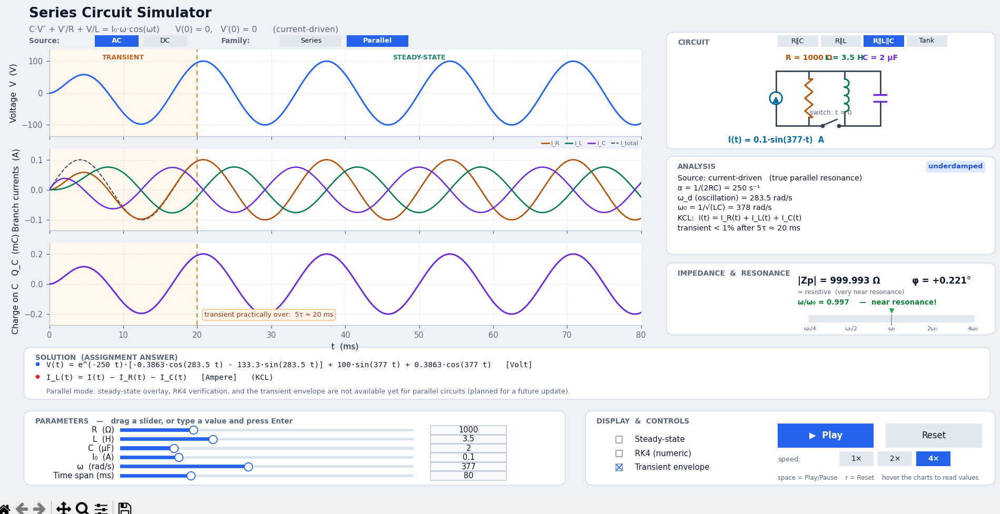
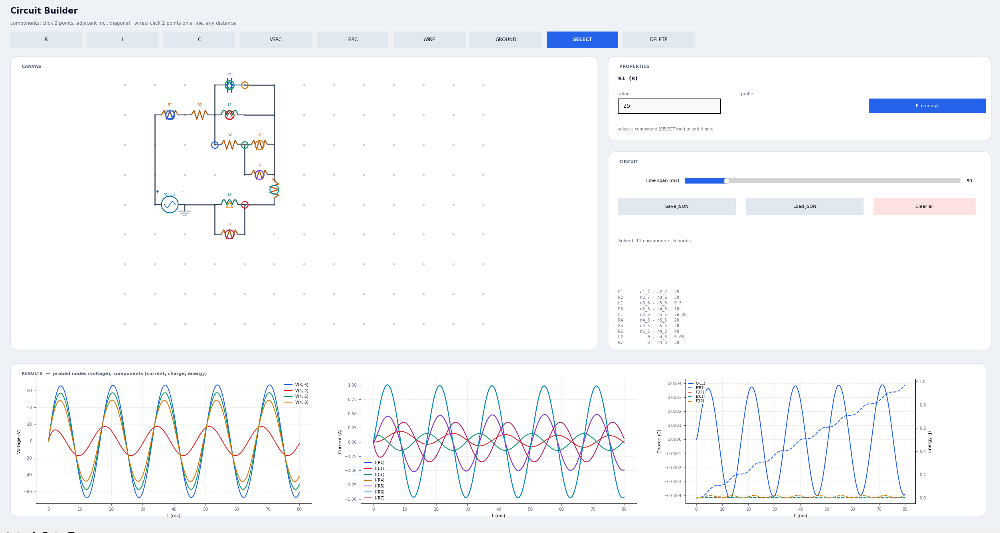

# Circuit Simulator — Series & Parallel R/L/C Networks

An interactive circuit simulator built around a classic series RLC problem
and grown from there. Two circuit **families** are available:

- **Series** — R, RC, RL, LC, or full RLC, all in one loop. Absent
  components are genuinely removed from the equation and the schematic, not
  just set to zero.
- **Parallel** (Milestone 2) — R∥C, R∥L, R∥L∥C, or a Tank (R in series with
  an L∥C tank). See [Parallel circuits](#parallel-circuits-milestone-2)
  below.

Every topology in both families can be driven by an **AC** source
(E₀·sin(ωt)) or a **DC** step (E₀ applied at t = 0), producing the classic
charging/discharging curves from circuit theory.

Underneath the fixed-preset UI, a general-purpose netlist engine (Milestone
3) can simulate **any** R/L/C/source network — see
[General netlist engine](#general-netlist-engine-milestone-3) below — and
on top of *that*, a free-form **circuit builder** (Milestone 4,
`rlc_builder.py`) lets you place and wire components on a grid instead of
picking from the 9 fixed presets — see
[Free-form circuit builder](#free-form-circuit-builder-milestone-4) below.

## Screenshots

**Fixed-preset simulator** — parallel R∥L∥C driven near resonance, with the
impedance/resonance panel and branch-current multi-trace chart:



**Free-form circuit builder** — an 11-component custom network with
voltage, current, charge, and energy all probed at once:



## Running

```
python rlc_simulator.py    # fixed-preset simulator (series + parallel)
python rlc_builder.py      # free-form circuit builder
```

Requires `numpy` and `matplotlib` (`pip install numpy matplotlib`).
`scipy` is optional but recommended — if present, the general netlist
engine (see below) solves noticeably faster; without it, it still works,
just slower.

Headless test mode (numeric verification + screenshots):

```
python rlc_simulator.py --test output.png
python rlc_builder.py --test output.png
```

## Controls

| Control | Function |
|---|---|
| **Series / Parallel** buttons (under the equation) | Choose the circuit family |
| **RLC / RL / RC / LC / R** or **R∥C / R∥L / R∥L∥C / Tank** buttons (CIRCUIT card) | Choose the topology within the active family; sliders of absent components are disabled automatically |
| **AC / DC** buttons (under the equation) | Choose the source: sinusoidal E₀·sin(ωt), or a DC step E₀ at t = 0. The ω slider disables in DC mode, and the impedance/resonance panel (an AC-only concept) is replaced by a note |
| **Play** button / space bar | Animate the curves progressively |
| **1× / 2× / 4×** buttons (or keys `1`/`2`/`4`) | Playback speed |
| **Reset** button / key `r` | Restore R, L, C, the amplitude, ω, and the time span to their defaults |
| Sliders R, L, C, amplitude, ω | Explore the effect of each component. The amplitude slider is **volts** for Series/Tank and **amps** for the current-driven parallel presets — it relabels and rescales automatically |
| **Numeric box** next to each slider | Type an exact value and press Enter (e.g. `1234.5` or `3,75`) — not limited by slider resolution or range |
| "Time span" slider | Change the displayed time window |
| **Steady-state** checkbox | Show the steady-state solution (dashed) — series family only |
| **RK4 (numeric)** checkbox | Verify the analytic solution with numerical integration — series family only |
| **Transient envelope** checkbox | Orange envelope: steady-state amplitude + transient decay bound — series family only |
| Hover the charts | Read the numeric values at the cursor (while paused) |

## Series charts

1. **Charge Q(t)** — capacitor charge (or *charge delivered* for topologies
   without a capacitor, where Q keeps a permanent offset).
2. **Current I(t)** — with initial-condition markers and RK4/steady-state
   overlays.
3. **Voltages** — source E(t) plus the per-component voltages V_R = R·I,
   V_L = L·dI/dt, and V_C = Q/C, color-matched to the schematic. Kirchhoff's
   voltage law V_R + V_L + V_C = E(t) holds exactly at every instant. Near
   resonance the plot shows the classic voltage magnification: V_L and V_C
   each exceed the 120 V source amplitude (~158 V) while nearly cancelling
   each other.

## Series circuit variants

| Topology | Equation | Character |
|---|---|---|
| **RLC** | L·Q″ + R·Q′ + Q/C = E(t) | 2nd order: underdamped / critical / overdamped |
| **RL** | L·Q″ + R·Q′ = E(t) | 1st-order in current, τ = L/R; Q = charge delivered (permanent offset) |
| **RC** | R·Q′ + Q/C = E(t) | 1st order, τ = RC, pure exponential decay |
| **LC** | L·Q″ + Q/C = E(t) | Undamped: the transient never decays (beats near resonance) |
| **R** | R·I = E(t) | Algebraic: current is immediately steady-state, no transient |

Every topology is solved with its own exact closed-form solution (RC and R
as true 1st-order systems, not numeric limits of the 2nd-order case), and all
of them are verified against RK4 integration in `--test` mode, including a
KVL check and an independent V_L = L·dI/dt check.

## Source types

| Source | E(t) | What it shows |
|---|---|---|
| **AC** (default) | E₀·sin(ωt) | Steady sinusoidal drive: a transient that settles into oscillation, impedance, phase angle, and (for the right topologies) resonance |
| **DC** | E₀ for t ≥ 0 (step) | Classic charging/discharging curves: RC capacitor charge-up, RL current rise, LC step ringing (never settles), RLC step response. The steady state is a constant (or a ramp for topologies without a capacitor) instead of a sinusoid |

The damping classification (underdamped/critical/overdamped/1st-order,
α, ω_d, the characteristic roots) is identical between AC and DC — it only
depends on R, L, C. Only the steady-state / particular solution and the
"Solution" formulas differ. Switching source type keeps the same topology,
component values, and time span.

## Parallel circuits

Switch to the **Parallel** family to explore four presets: **R∥C**, **R∥L**,
**R∥L∥C**, and **Tank** (R in series with an L∥C tank).

R∥C, R∥L, and R∥L∥C are driven by a **current source** I(t), not a voltage
source — the dual of the series case. An ideal voltage source forced
directly across parallel branches would decouple them completely (no branch
would affect another, and no resonance could show up), so a current source
is used instead, exactly as classic parallel-resonance circuit theory does.
The Tank preset stays voltage-driven since R is genuinely in series with
the source there. This is also why the amplitude slider relabels itself:
**I₀ (A)** for the three current-driven presets, **E₀ (V)** for Tank.

| Preset | Equation | Character |
|---|---|---|
| **R∥C** | C·V′ + V/R = I(t) | 1st order, τ = RC — no resonance |
| **R∥L** | (L/R)·I_L′ + I_L = I(t) | 1st order, τ = L/R — no resonance |
| **R∥L∥C** | C·V″ + V′/R + V/L = I′(t) | 2nd order: **true parallel (anti)resonance** — near ω₀ the L and C branch currents nearly cancel, so V is maximized |
| **Tank** | C·V_t″ + V_t′/R + V_t/L = E′(t)/R | 2nd order: R limits current into an L∥C tank that blocks current hardest near ω₀ (a notch/band-stop character) |

### Parallel charts

Since a parallel circuit has one shared voltage but several branch
currents, the three charts are repurposed:

1. **Voltage** — the node voltage V(t) (or, for Tank, both the tank
   voltage V_t(t) and the source E(t), so you can see the filtering
   directly).
2. **Branch currents** — multi-trace: I_R, I_L, I_C (whichever branches are
   present), plus I_total, color-matched to the schematic components.
3. **Charge on C** — Q_C(t) = C·V(t), or a note if the preset has no
   capacitor (R∥L).

The IMPEDANCE & RESONANCE panel shows the parallel impedance |Zp| and phase
(only for R∥L∥C and Tank in AC mode, since R∥C/R∥L have no resonance), and
the 5τ transient marker works the same way as in series mode. Steady-state
overlay, RK4 verification, and the transient envelope are series-only for
now — planned for a future update.

## General netlist engine

Underneath the app's fixed presets there is a genuinely general circuit
solver: build **any** network of resistors, inductors, capacitors, and
voltage/current sources, and simulate it — not just the 9 topologies the
fixed-preset UI exposes. [`rlc_builder.py`](#free-form-circuit-builder-milestone-4)
is the interactive UI on top of it; you can also drive it directly from
Python:

```python
from rlc_netlist import Netlist
from rlc_mna import simulate, probe_voltage, probe_current, probe_charge
import numpy as np

nl = Netlist()
nl.add("VSRC", "in", "0", 120.0, name="E", source_type="AC", freq=377.0)
nl.add("R", "in", "mid", 1000.0)
nl.add("L", "mid", "out", 3.5)
nl.add("C", "out", "0", 2e-6)

t = np.linspace(0, 0.08, 4000)
result = simulate(nl, t)

v_mid = probe_voltage(result, "mid")
i_r1 = probe_current(result, "R1")
q_c1 = probe_charge(result, "C1")
```

It solves via trapezoidal **Modified Nodal Analysis** (the same method
SPICE uses): node voltages plus one branch-current unknown per voltage
source, with inductors and capacitors reduced to a companion
(conductance + history current source) model each step. Save/share a
circuit with `Netlist.to_json()` / `Netlist.from_json()`.

**Verified**, not just written: cross-checked against all 9 existing
closed-form presets (5 series + 4 parallel) × AC/DC, matching to within
~10⁻⁴ relative error — consistent with the expected 2nd-order trapezoidal
discretization error, permanently re-run in `--test`. `probe_energy()`
also reports stored energy in any L/C and cumulative dissipated energy in
any R. Performance: a 19-component circuit resolves at ~20 recomputes/sec
at the app's default 3000-sample resolution — fast enough for live
interactive use, though it degrades at much higher sample counts.

## Free-form circuit builder

```
python rlc_builder.py
```

A standalone editor: place components on a snapped grid, wire them
together, and see the result update live — no longer limited to the 9
fixed presets above.

**Palette:** `R  L  C  VSRC  ISRC  WIRE  GROUND  SELECT  DELETE`

1. **Components** (R/L/C/VSRC/ISRC): click a grid point, then click an
   **adjacent** grid point — horizontal, vertical, or 45° diagonal (handy
   for delta-star-style wiring) — to place that component between them.
   Whichever direction you click determines the orientation; there's no
   separate rotate step. Clicking a non-adjacent point just moves your
   anchor there instead of placing anything.
2. **Wires**: click a start point, then click *any other* point in a
   straight line from it — horizontal, vertical, or diagonal, any
   distance. Every grid point in between is wired automatically, so a long
   run takes two clicks instead of one per hop.
3. **Ground**: click any grid point to make it "0" — the reference every
   voltage is measured against.
4. **Select**: click a component to edit its value (and, for VSRC/ISRC,
   toggle AC/DC, set ω, and flip polarity) in the PROPERTIES card, and to
   toggle its current into the RESULTS charts. Click a bare grid point to
   toggle its voltage into the results instead. For R/L/C, the same card
   shows **Q (charge)** and **E (energy)** probe buttons instead of the
   source controls — Q only appears for capacitors, E for any of R/L/C —
   letting you probe charge/energy independently of (and in addition to)
   the current probe.
5. **Delete**: click a component or wire to remove it.
6. **Save JSON** / **Load JSON**: write or read back the circuit
   (`Netlist.to_json()`/`from_json()` under the hood) via a normal file
   picker.

The circuit resolves automatically after every edit as soon as it has a
ground and a source and validates — before that, the CIRCUIT card tells
you what's missing in plain language rather than failing silently or
crashing. This includes **short circuits**: if a wire connects both
terminals of the same component to one node (directly, or through a longer
chain of wires), the status bar names the offending component instead of
crashing — remove the shorting wire or move the component to fix it.

**Source polarity:** whichever grid point you click **first** when placing
a VSRC/ISRC is node_a — its "+" terminal (VSRC) or the direction current
flows away from (ISRC), the same node_a/node_b convention the netlist
engine uses everywhere. This is marked on the schematic itself (+/− labels
on VSRC, the arrow on ISRC) and shown in the PROPERTIES card; it can be
reversed after the fact with the **flip polarity** button instead of
deleting and re-placing the source in the opposite click order — this
matters because, exactly like a real battery, swapping which terminal
lands where flips the sign of every current and charge downstream of it.

**AC vs. DC symbols:** VSRC draws as a circle with a sine wiggle for AC,
or a battery bar pair (long/thin near "+", short/thick near "−") for DC,
so the two aren't visually confusable. ISRC always draws as a circled
arrow (the arrow is itself the polarity/direction indicator); AC adds a
small sine tick inside the circle. When **every** source in the circuit is
DC, small grey arrows appear on each component showing the actual
(steady-state) current direction — omitted for AC circuits since the
direction reverses every half-cycle there.

**Charge & energy probes:** in addition to voltage/current, a capacitor can
be probed for charge (`Q = C·V`) and any of R/L/C for energy (½CV² / ½LI²
for L/C, cumulative ∫I²R·dt for R) via the Q/E buttons described above.
Probed components get a small diamond (Q) and/or triangle (E) badge on the
canvas, nested with the existing current-probe circle. Both plot on a third
RESULTS chart with charge on the left axis (Coulombs, solid lines) and
energy on the right axis (Joules, dashed lines) — they're combined into one
chart, on twin y-axes, rather than getting a fourth chart each, since the
two units don't share a scale.

## Display elements

- **Transient → steady-state marker**: the transient region is shaded orange
  and bounded by a dashed line at t = 5τ ("transient practically over"), with
  TRANSIENT / STEADY-STATE labels above the chart. τ uses the slowest decay
  mode (for overdamped: 1/|r₁|). If 5τ exceeds the time window the whole
  chart is shaded; with no transient at all (R-only) the whole chart is
  labeled STEADY-STATE.
- **Damping badge** in the ANALYSIS panel: underdamped / critically damped /
  overdamped / 1st-order / undamped / no transient, colored by case.
- **IMPEDANCE & RESONANCE panel**: the impedance triangle (R, X = X_L−X_C, Z)
  drawn to true scale, |Z| and φ values, the circuit character
  (inductive/capacitive/resistive), and a gauge of ω against ω₀ (only when
  both L and C are present; the marker turns green near resonance).
- **Adaptive resolution**: the number of curve points follows ω, ω₀, and the
  time constants so curves stay smooth even for extreme typed values.

## File structure

| File | Contents |
|---|---|
| `rlc_simulator.py` | Entry point + `--test` mode |
| `rlc_app.py` | Matplotlib UI (charts, cards, widgets, animation, both families) |
| `rlc_solver.py` | Exact analytic solutions, series and parallel, + RK4 check (pure numpy) |
| `rlc_schematic.py` | Circuit schematics — series (`Schematic`) and parallel (`ParallelSchematic`) |
| `rlc_config.py` | Shared constants: defaults, input bounds, theme, topologies |
| `rlc_netlist.py` | General netlist data model: `Component`, `Netlist`, JSON round-trip (pure Python) |
| `rlc_mna.py` | General trapezoidal-MNA transient solver + probes API (pure numpy, optional scipy for speed) |
| `rlc_builder.py` | Free-form circuit builder: standalone app + its own `--test` mode |
